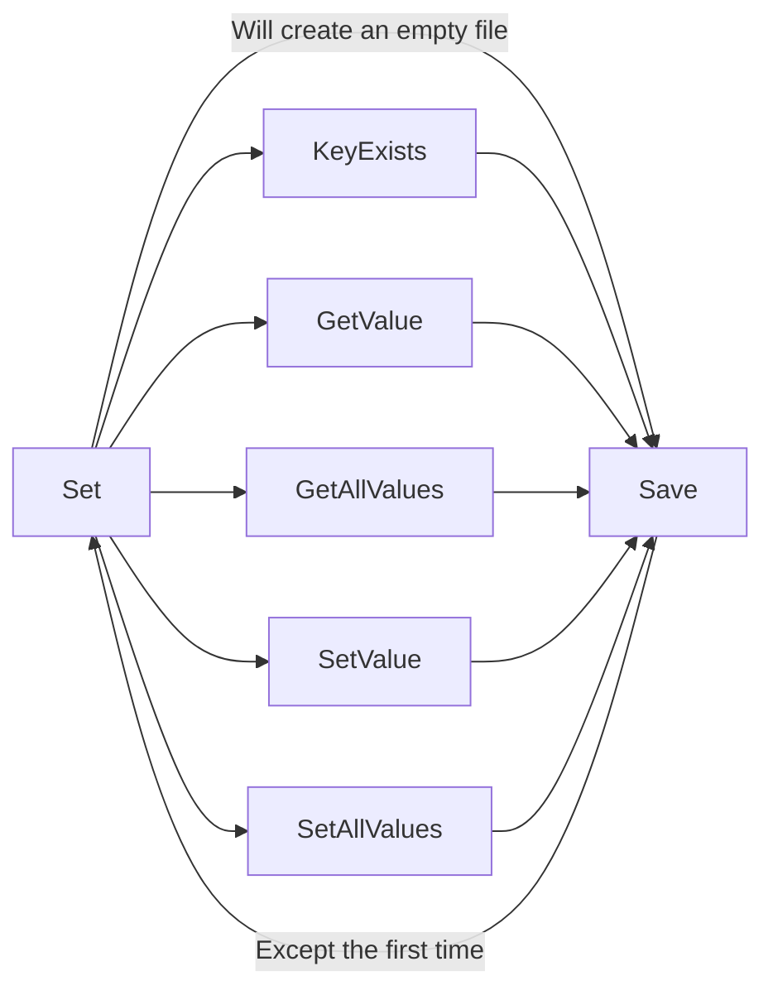

# Simple JSON config handler<!-- omit from toc -->

A simple library to add a key-value pair based configuration manager to any .NET project.

## Table of contents<!-- omit from toc -->

1. [Quick start guide](#quick-start-guide)
2. [Manage multiple value sets](#manage-multiple-value-sets)
3. [Public methods](#public-methods)
4. [Safety functions](#safety-functions)
5. [Method call order](#method-call-order)

## Quick start guide

1. Add `Config.dll` or `Config.cs` to your project
3. Load (or create a new) key and value set with `Config.Set(filePath)`
4. Get values from existing keys with `Config.GetValue()`
5. Set values for new or existing keys with `Config.SetValue()`
6. Save your keys and values for the next session with `Config.Save()`

> Values are stored as a `string`. An appropriate parsing procedure must be used to convert it to and from other types.

> For a code example, see [ConfigExample/Program.cs](ConfigExample/Program.cs)

The above code example will create `test_config.json` in the user documents folder with the following content:

```json
{
  "name": "John Doe",
  "ip_address": "127.0.0.1",
  "port": "1234"
}
```

## Manage multiple value sets

Create and use multiple value sets by subsequent calls to `Set`

```cs
string set1 = "first.json";
string set2 = "second.json";

// Create a value set
Config.Set(set1);
Config.SetValue("name", "Jane Doe");
Config.Save();

// Create another value set
Config.Set(set2);
Config.SetValue("height", "1080");
Config.SetValue("width", "1920");
Config.Save();

// Load and use the first value set
Config.Set(set1);
Console.WriteLine($"name:\t{Config.GetValue("name", "Failsafe Frank")}");

// Load and use the second value set
Config.Set(set2);
Console.WriteLine($"height:\t{Config.GetValue("height", "999")}");
Console.WriteLine($"width:\t{Config.GetValue("width", "999")}");
```

## Public methods

| Method | Description | Parameters | Returns |
| --- | --- | --- | --- |
| `string FilePath` | Get the current value set file path || The current value set file path |
| `void Set(string filePath)` | Set (and load) the value set file to use | `filePath`: Value set file to use ||
| `bool KeyExists(string key)` | Check if a key exists | `key`: Unique key | True, if the key exists |
| `string GetValue(string key)` | Get the current value for a key | `key`: Unique key | Current value for the key or null |
| `string GetValue(string key, string defaultValue)` | Get the current value or a default value for a key | `key`: Unique key<br>`defaultValue`: Value to return if the key does not exist | Current value for the key or defaultValue |
| `Dictionary<string, string> GetAllValues()` | Get the entire value set || Current value set |
| `void SetValue(string key, string value)` | Set a new value for a key or create a new key with a value | `key`: Unique key<br>`value`: New value ||
| `void SetAllValues(Dictionary<string, string> values)` | Overwrite the entire value set | `values`: New value set ||
| `void Save()` | Save the current value set |||

> All the methods are static, no `Config` instance needs to be created.

## Safety functions

- Keys and values are stored in a `Dictionary`, so no duplicate keys can exist.
- The file path can include or exclude the `.json` postfix. It will be appended to it if missed.
- `Save` must be called before subsequent `Set` calls if any values were added or changed by any of the `Set*` methods. If missed, an exception will be thrown with the message `There are unsaved changes that would be lost. Call Save() first.`
- If the config file does not exist when `Set` is called, the config manager will start creating the keys and values in memory. The next call to `Save` will create the file.
- If any exception is thrown during file loading inside the `Set` method, an exception will be thrown with the message `Error loading config file.` and the original exception as the `innerException`.
- The value set must be set with `Set` before calling `KeyExists`, `Save` or any of the `Get` or `Set*` methods. If any of these are called without the value set being set, an exception will be thrown with the message `No current value set is set. Call Set() before making changes.`
- The `GetValue` method with the `defaultValue` parameter is to provide a failsafe value retrieval.
- A call to `GetAllValues` will return a copy of the underlying `Dictionary` to protect it's values in the absence of a call to `SetAllValues`.
- If any exception is thrown during the `Save` method, an exception will be thrown with the message `Error saving config file.` and the original exception as the `innerException`.

## Method call order


